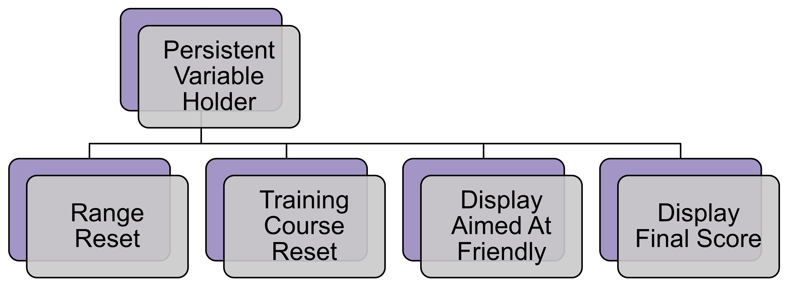

# [Display Aimed At Friendly](https://github.com/joshberger5/Temptare/blob/second/Assets/DisplayAimedAtFriendly.cs)
This script appends the number of times the user aimed at [friendly targets](../prefabs.html#body) in the [Training Course](../Scenes/trainingCourse.html) scene to the message the script is attached to. This is for the [Win](../Scenes/win.html) scene and the losing scenes ([Dropped Guns Prevention](../Scenes/droppedGunsPrevention.html), [Shot Friendly](../Scenes/shotFriendly.html), [Self Harm Prevention](../Scenes/selfHarmPrevention.html)).

## Variables
This script has no variables.

## Methods
```csharp
void Start()
{   
    if (PersistentVarHolder.Instance != null)
    {
        this.GetComponent<TextMeshProUGUI>().text += PersistentVarHolder.Instance.aimedAtFriendlyCount.ToString();
    }
    else
    {
        this.GetComponent<TextMeshProUGUI>().text += "0";
    }
}
```

