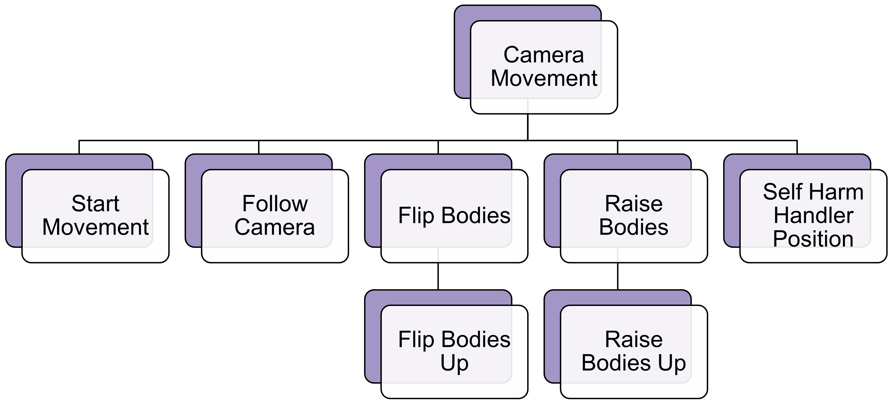

# [Flip Bodies](https://github.com/joshberger5/Temptare/blob/second/Assets/FlipBodies.cs)
This script makes each [body/target](../prefabs.html#body) in the given array start flipping up by setting flip to true in the body/target's [FlipBodyUp](./FlipBodyUp.html) script. This script is attached to [CameraBodyFlipper](../prefabs.html#cameracolliders) GameObjects.

## Variables
```csharp
[SerializeField]
private GameObject[] bodies; // array of bodies to flip
```

## Methods
```csharp
public void flip() // flips the bodies
{
    foreach (GameObject body in bodies) // flip each body in the array
    {
        body.GetComponent<FlipBodyUp>().flip = true;
    }
}
```

