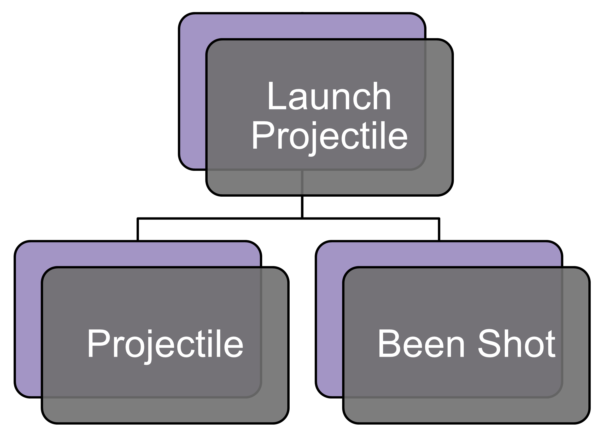

# [Launch Projectile](https://github.com/joshberger5/Temptare/blob/second/Assets/LaunchProjectile.cs)
This script contains the mechanics for the blasters, such as firing projectiles, keeping score, and checking where the user is aiming.

## Variables
```csharp
[SerializeField]
private GameObject projectilePrefab = null; // the prefab for the projectile

[SerializeField]
private Transform startPoint = null; // where the projectile will be instantiated

[SerializeField]
public GameObject scoreKeeper = null;  // the object that displays the score

public static int localScore = 0; // the local score (mainly for the range scene)

private bool wasAimingAtFriendly = false; // whether the player was aiming at a friendly last frame

private bool isHeld = false; // whether the player is holding the projectile launcher
```

## Methods
```csharp
void FixedUpdate() { // handles aiming at friendlies
    RaycastHit hit;
    if (Physics.Raycast(startPoint.position, startPoint.forward, out hit, Mathf.Infinity)) // otherwise, check if the player is aiming at a friendly or themself
    {
        if (hit.collider.gameObject.CompareTag("Friendly")) // if they are aiming at a friendly, check if they were during last frame as well
        {
            if (!wasAimingAtFriendly) // if they weren't, increment the number of times the player aimed at a friendly and make a note that they were
            {
                if (PersistentVarHolder.Instance != null)
                {
                    PersistentVarHolder.Instance.aimedAtFriendlyCount++;
                }
                wasAimingAtFriendly = true;
            }
        }
        else if (hit.collider.gameObject.CompareTag("SelfHarmHandler") && isHeld) // if they are aiming at themself, end the game
        {
            SceneManager.LoadScene("SelfHarmPrevention");
        }
        else // if the player is not aiming at a friendly, make a note that they weren't
        {
            wasAimingAtFriendly = false;
        }
    }
}

public void pickedUp() // sets isHeld to true
{
    isHeld = true;
}

public void putDown() // sets isHeld to false
{
    isHeld = false;
}

public bool getIsHeld() {
    return isHeld;
}

public void Fire() // spawns the projectile
{
    GameObject newObject = Instantiate(projectilePrefab, startPoint.position, startPoint.rotation);
}

void Update() // displays the score
{
    if (scoreKeeper != null) 
    {
        if (PersistentVarHolder.Instance != null && SceneManager.GetActiveScene().name != "Range")
        {
            scoreKeeper.GetComponent<TextMeshProUGUI>().text = PersistentVarHolder.Instance.score.ToString();
        }
        else 
        {
            scoreKeeper.GetComponent<TextMeshProUGUI>().text = localScore.ToString();
        }
    }
}
```

