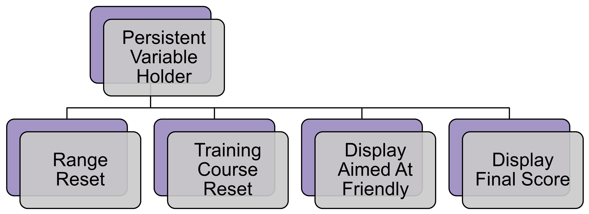

# [Range Reset](https://github.com/joshberger5/Temptare/blob/second/Assets/RangeReset.cs)
This script resets the [Training Course](../Scenes/range.html) scene's score when the scene is loaded.

## Variables
This script has no variables.

## Methods
```csharp
void Start() // resets the local score on startup of the Range scene
{
    LaunchProjectile.localScore = 0;
}
```

