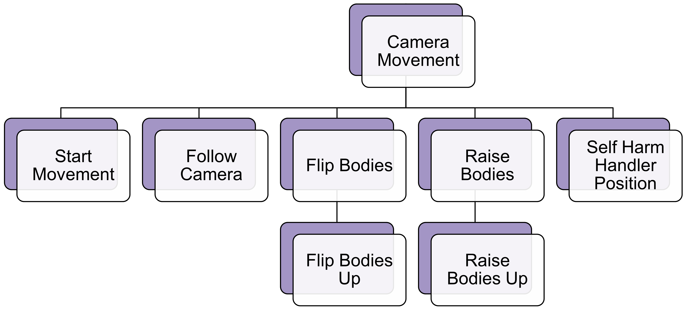

# [StartMovement](https://github.com/joshberger5/Temptare/blob/second/Assets/StartMovement.cs)
This script starts the camera's movement in the TrainingCourse scene. It is attached to the red wall in front of the user, so when the user shoots it, the user starts moving along the predetermined route.

## Variables
```csharp
[SerializeField]
GameObject camera;
```

## Methods
```csharp
private void OnCollisionEnter(Collision collision) 
{
    // when this object collides with another object, start the camera's movement
    camera.GetComponent<CameraMovement>().Move();
    Destroy(gameObject);
}
```

