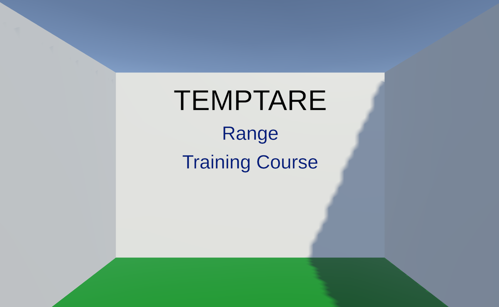

# Main Menu Scene

This is the landing scene for when the user loads the game. There are two [blasters](../prefabs.html#blaster) located in front of the user, where they can be picked up and used to shoot either Range or Training Course. Shooting Range will take the user to the [Range](./Scenes/range.html) scene. Shooting Training Course will take the user to the [Training Course](./Scenes/trainingCourse.html) scene. The words with blue letters in this game act similarly to hyperlinks. 
