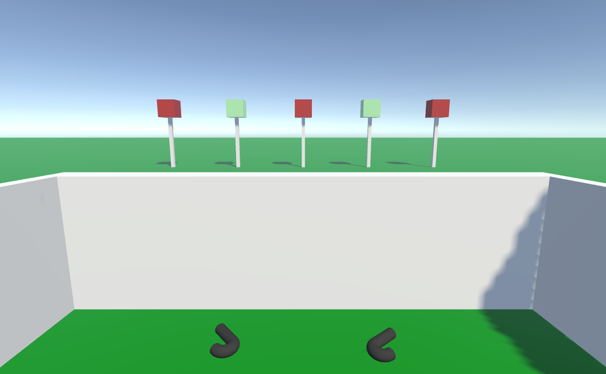

# Range Scene

This scene is made to teach the user the controls and rules of the game. The user again has the ability to pick up the two blasters in front of them. Shooting the red blocks (hostile targets) will increase the score located above the user's head. Shooting the green blocks (friendly targets) will display a message warning the user not to shoot friendly targets. If the user turns around, there is a hyperlink, which takes the user back to the Main Menu scene.