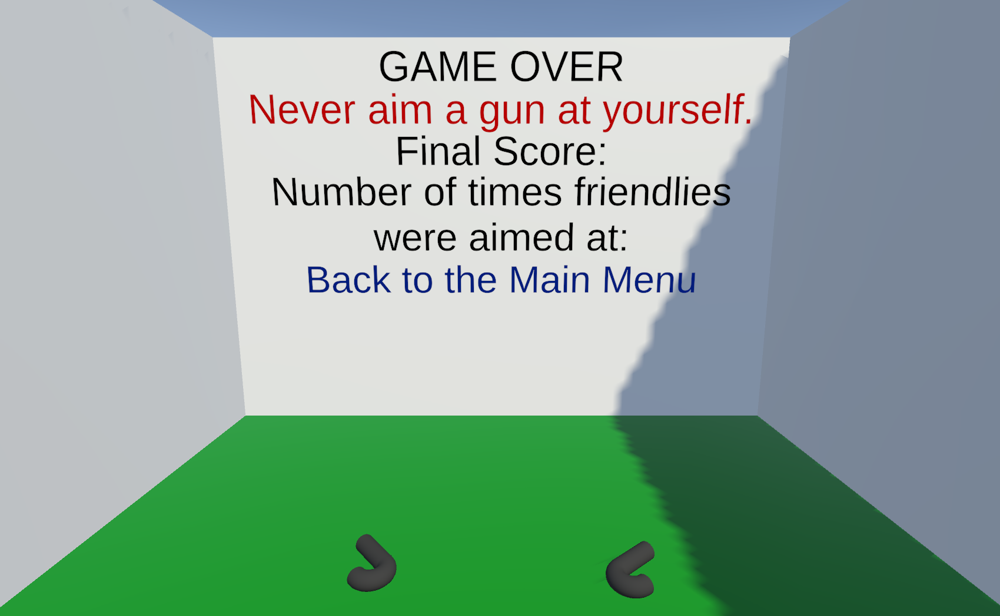

# Self Harm Prevention Scene

This is the scene the user is taken to upon aiming at themselves in any scene. The user is presented with a warning, their final score, and the number of times they aimed at a friendly target. There is also a hyperlink taking them back to the Main Menu.