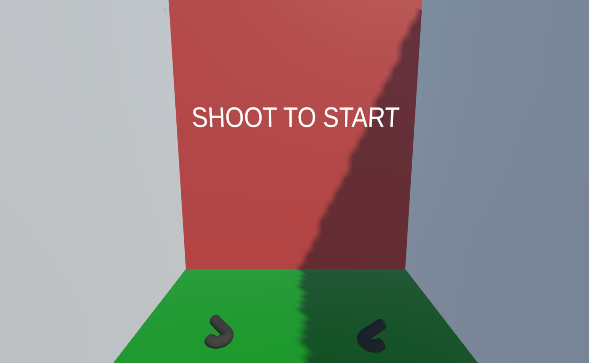
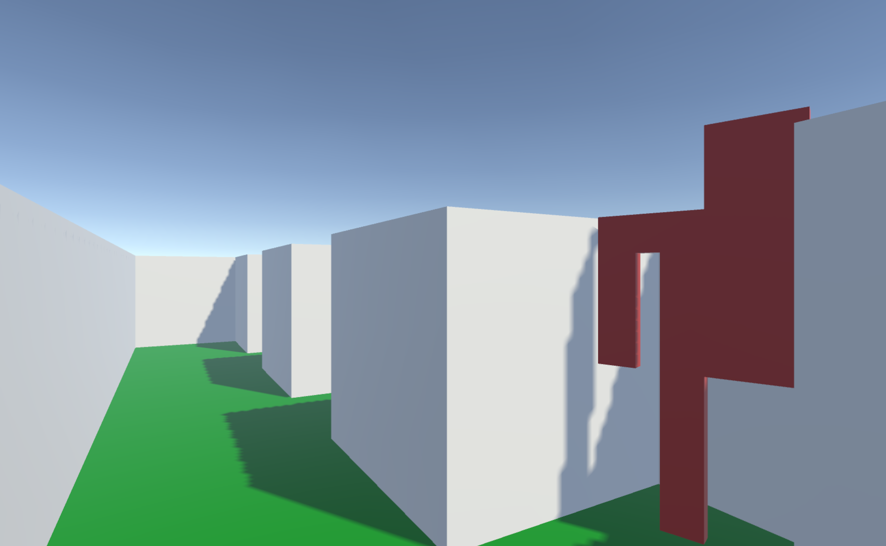

# Training Course Scene

This scene is where gun safety teaching mainly comes to life in the game. The user again has the ability to pick up the two [blasters](../prefabs.html#blaster) in front of them. They can either shoot the red wall in front of them to begin moving along the predetermined route, or they can turn around and shoot the hyperlink to take them back to the [Main Menu](./Scenes/mainMenu.html). There are three locations where [body-shaped targets](../prefabs.html#body) pop up and the user can shoot them. Only shooting the red (hostile) targets increases the score. Shooting the green (friendly) targets takes them to the Shot Friendly scene. Unbeknownst to the user, the number of times they aim at friendly targets is counted as well. If they reach the end without shooting a friendly target, they are taken to the [Win](./Scenes/win.html) scene. If the user drops all the blasters they were holding once they have started moving, they are taken to the [Dropped Guns Prevention](./Scenes/droppedGunsPrevention.html) scene, because it would be pretty boring going through the Training Course without being able to shoot anything. It is also good practice not to drop the gun you are holding.

In the first image on the page, the transparent boxes are the [Camera Colliders](../prefabs.html#cameracolliders), they initiate specific actions when the user reaches them. When the user moves down the first hallway and reaches the first transparent box, they are turned to avoid hitting the wall, when they reach the second one, the first set of targets are flipped up to face the user, and so on.

