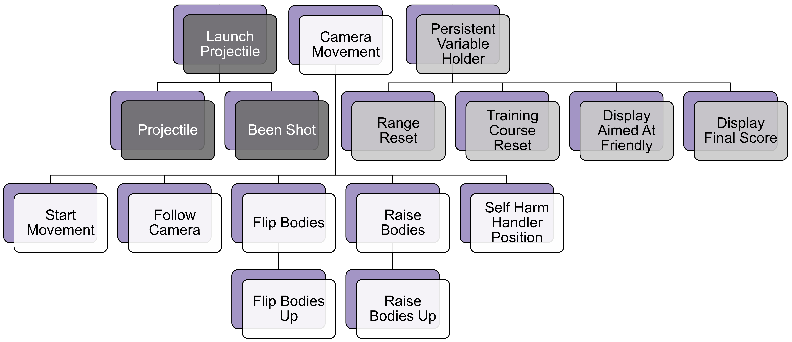

# Code
## What is a Script? What is it used for?
"**Scripts** are behavior components that can be applied to GameObjects and modified in the Unity Inspector. A script is made up of C# code that is executed during gameplay. Scripts can also be used to create tools in Unity to modify the development process."[^1]

## Code Hierarchy


This is the hierarchy of the scripts. The scripts with the same background color go together. For the most part, the children scripts add functionality to the parent scripts. For example, the Launch Projectile script is the Projectile script's parent, because, among other things, the Launch Projectile script fires a bullet, then the Projectile script controls the mechanics for that bullet.

## Before you look at the Scripts
These are some things that show up in the code that may be unfamiliar to you:

### SerializeField
**SerializeField** adds a field in Unity's manual interface to either drag and drop a GameObject or Prefab or manually enter a value for the variable.[^2]
```csharp
[SerializeField]
variableType variableName = value;
```

## MonoBehaviour Methods:
"**MonoBehaviour** is a base class that many Unity scripts derive from. MonoBehaviour offers life cycle functions that make it easier to develop with Unity."[^3]

### Start()
The **Start()** method "is called on the frame when a script is enabled just before any of the Update methods are called the first time."[^4]

### Update()
The **Update()** method "is called every frame."[^5]

### FixedUpdate()
The **FixedUpdate()** method is similar to Update(), but it typically happens at a different fequency than once per frame. 

"MonoBehaviour.FixedUpdate has the frequency of the physics system; it is called every fixed frame-rate frame. Compute Physics system calculations after FixedUpdate... The FixedUpdate frequency is more or less than Update. If the application runs at 25 frames per second (fps), Unity calls it approximately twice per frame, Alternatively, 100 fps causes approximately two rendering frames with one FixedUpdate."[^6]

### Awake()
"Unity calls **Awake** when an enabled script instance is being loaded.

Unity calls Awake on scripts derived from MonoBehaviour in the following scenarios:
* The parent GameObject is active and initializes on Scene load
* The parent GameObject goes from inactive to active
* After initialization of a parent GameObject created with Object.Instantiate

Use Awake to initialize variables or states before the application starts."[^7]

----

[^1]: [UnityLearn](https://learn.unity.com/tutorial/working-with-scripts#)
[^2]: [UnityDocs - SerializeField](https://docs.unity3d.com/ScriptReference/SerializeField.html)
[^3]: [UnityDocs - MonoBehaviour](https://docs.unity3d.com/ScriptReference/MonoBehaviour.html)
[^4]: [UnityDocs - Start](https://docs.unity3d.com/ScriptReference/MonoBehaviour.Start.html)
[^5]: [UnityDocs - Update](https://docs.unity3d.com/ScriptReference/MonoBehaviour.Update.html)
[^6]: [UnityDocs - FixedUpdate](https://docs.unity3d.com/ScriptReference/MonoBehaviour.FixedUpdate.html)
[^7]: [UnityDocs - Awake](https://docs.unity3d.com/ScriptReference/MonoBehaviour.Awake.html)