# Gameplay Image Gallery
This is the view at certain points during the game with the headset on, organized by scene.

    <h3 style="float: left; width: 51%"><a href="./Scenes/mainMenu.html">Main Menu</a></h3>
    <h3 style="float: left"><a href="./Scenes/range.html">Range</a></h3>

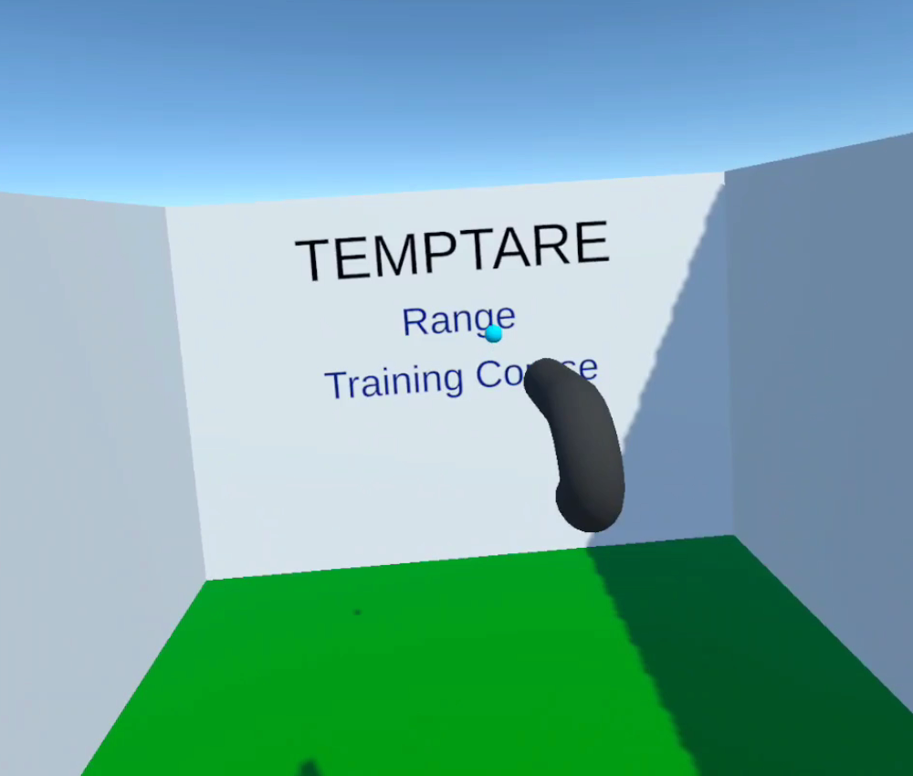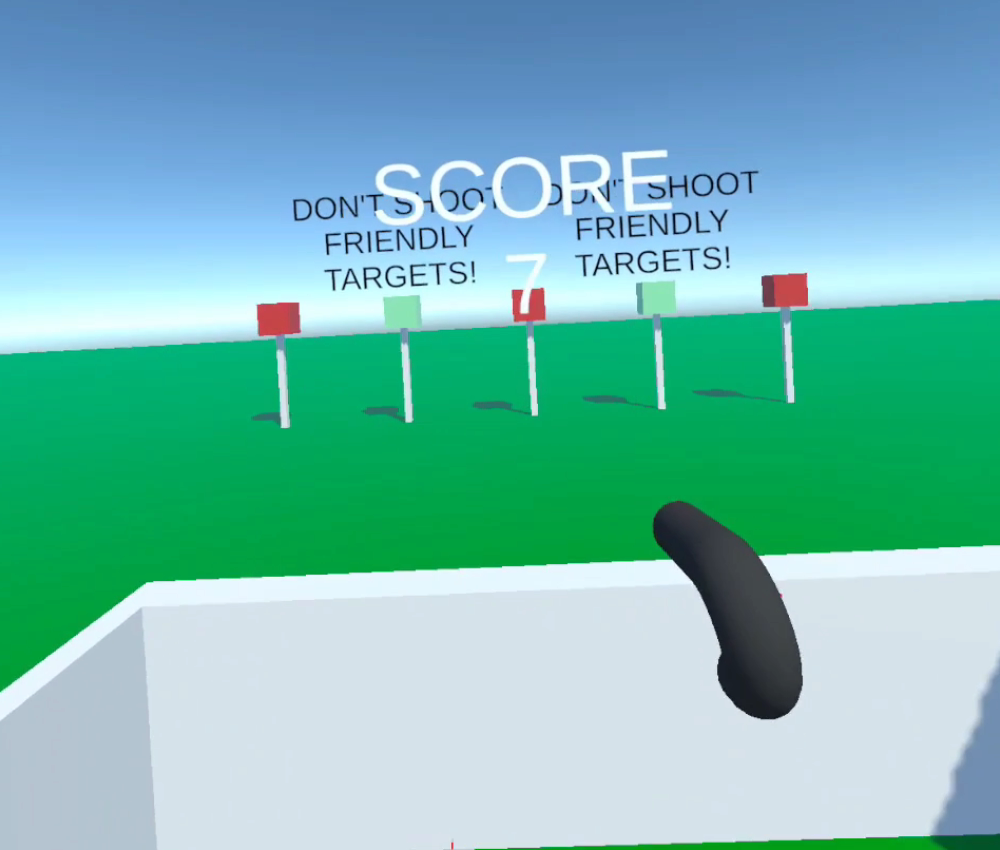

### [Training Course](./Scenes/trainingCourse.html)
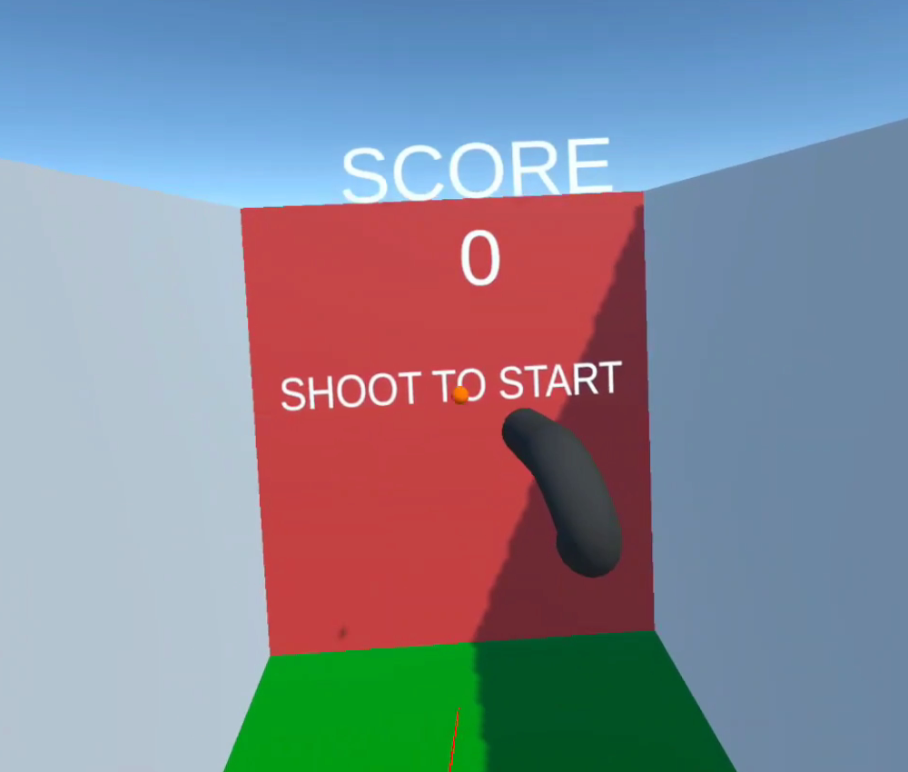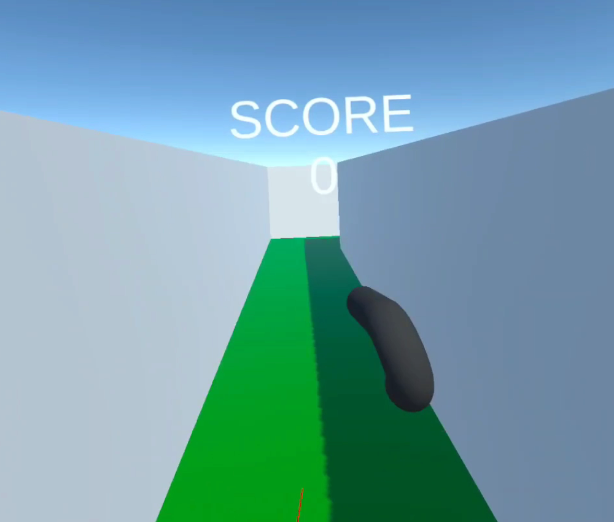
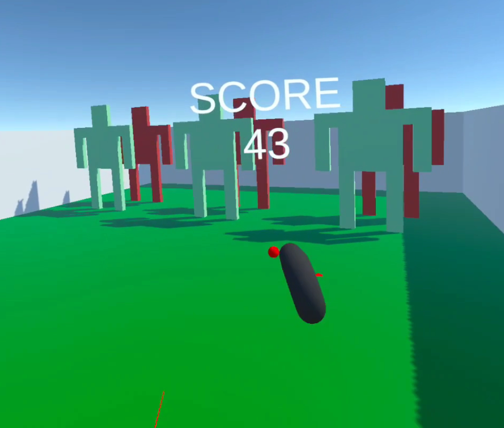
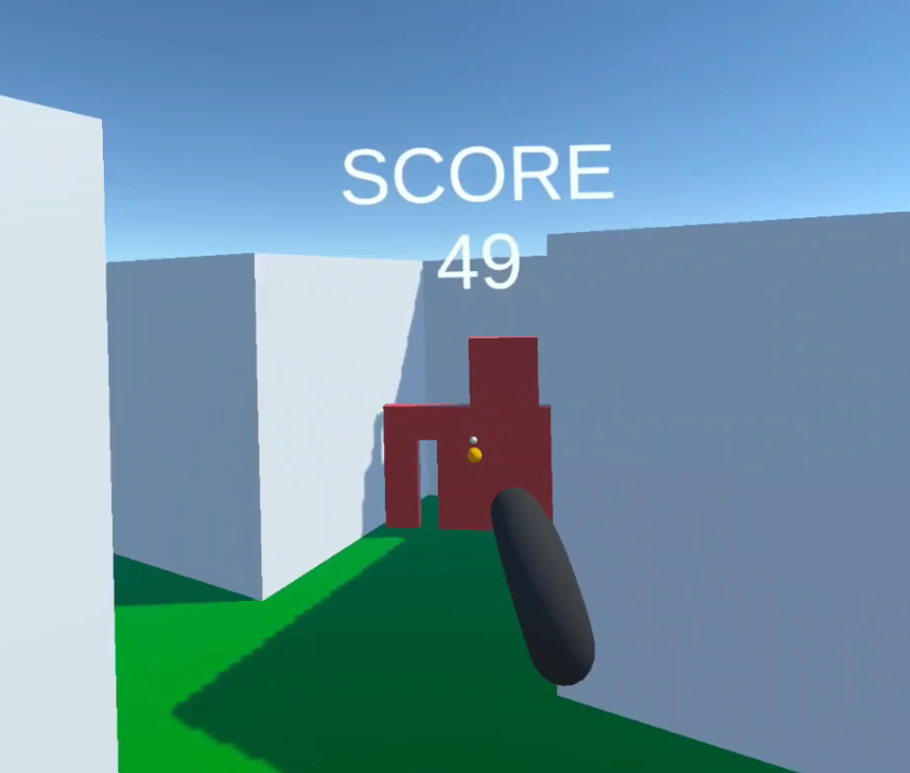

### [Self Harm Prevention](./Scenes/selfHarmPrevention.html)
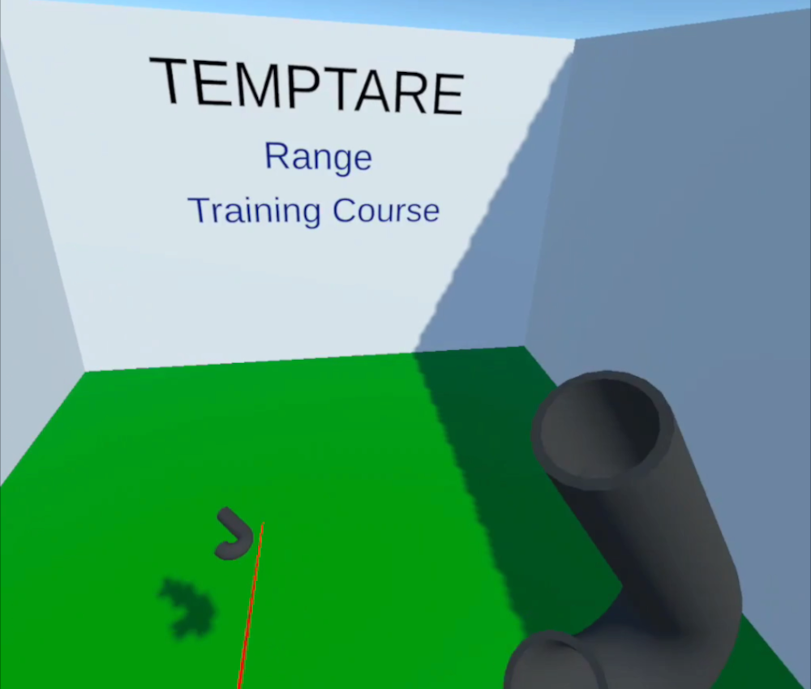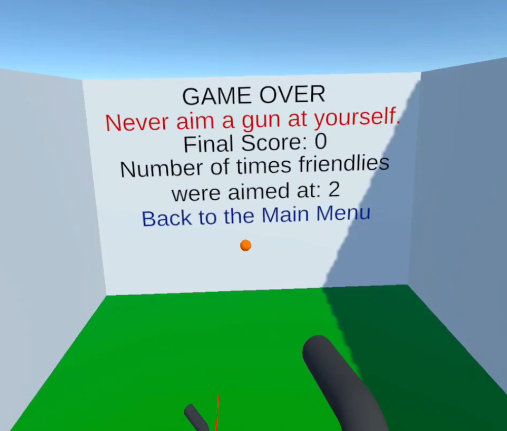

### [Dropping Guns in Training Course](./Scenes/droppedGunsPrevention.html)
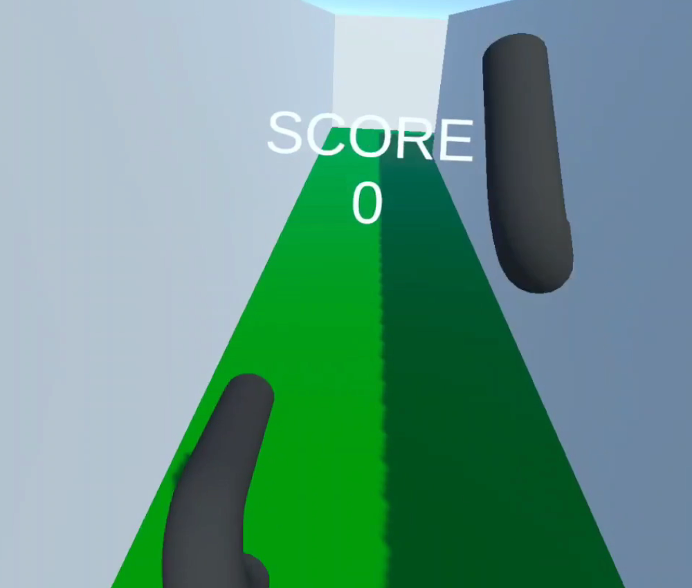

### [Shooting a Friendly](./Scenes/shotFriendly.html)
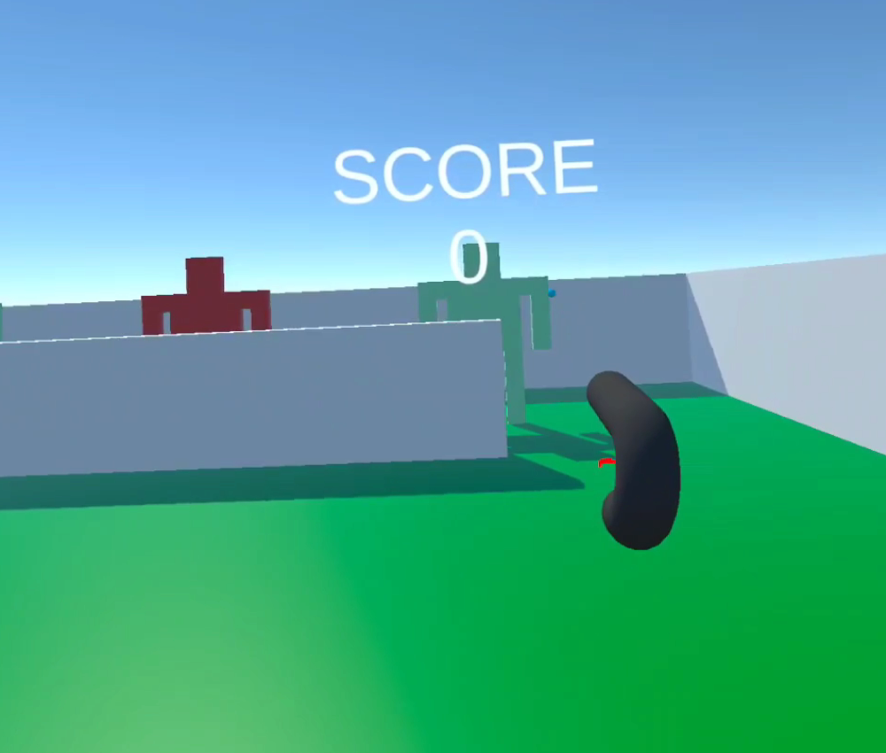

### [Winning](./Scenes/win.html)
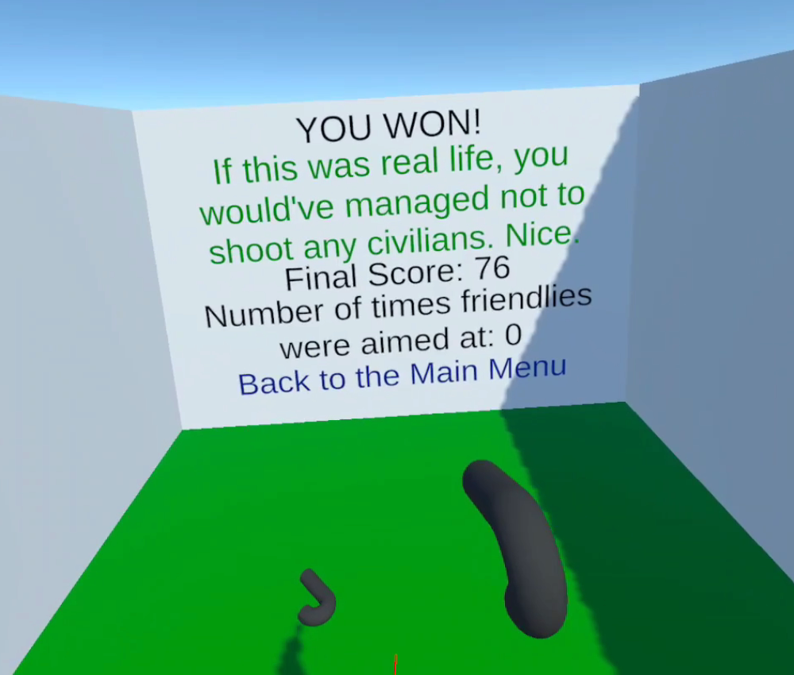

