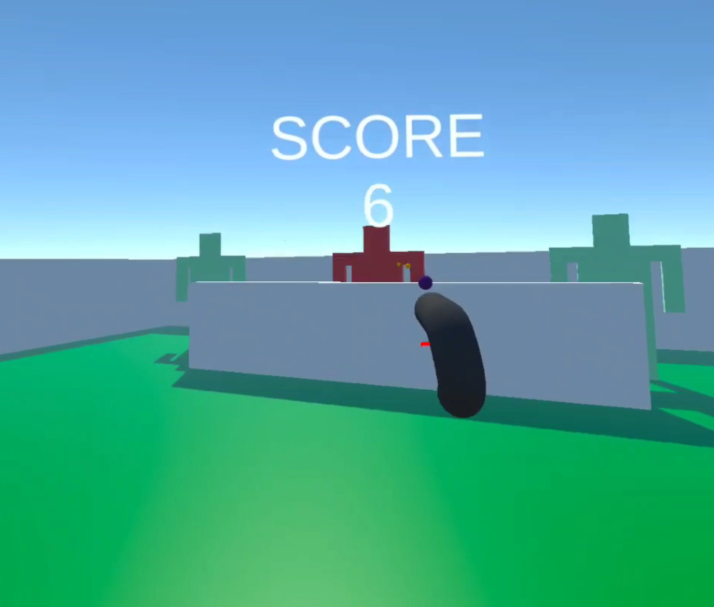
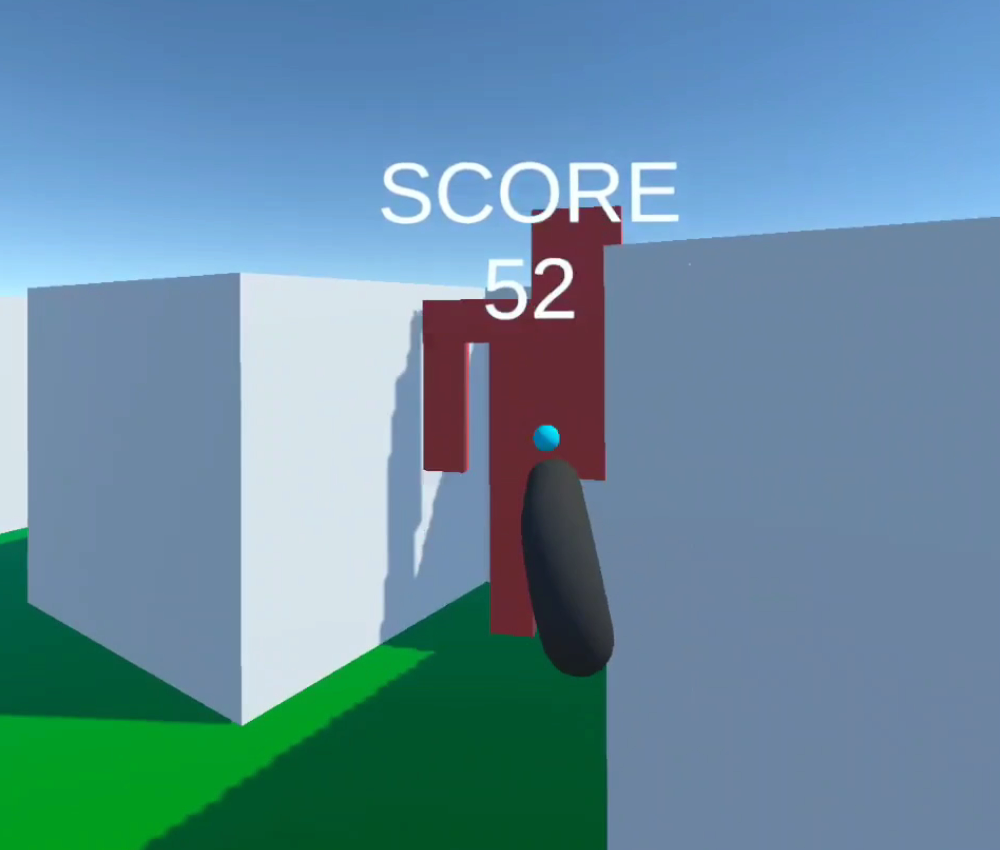
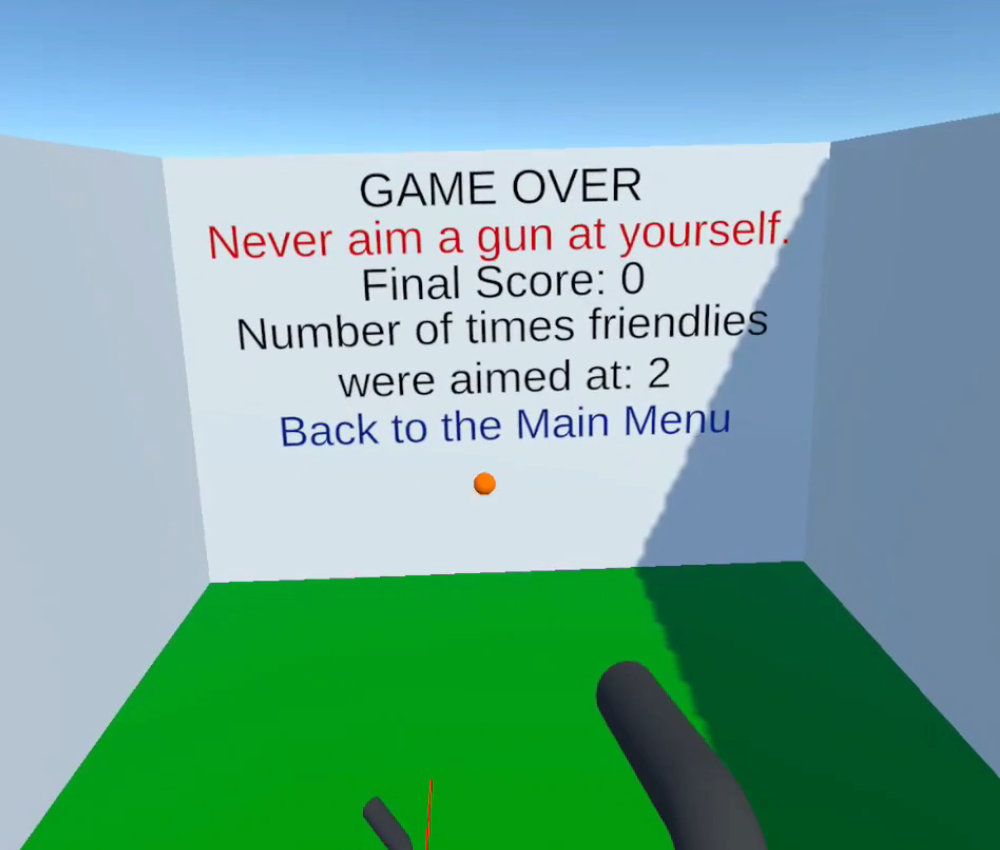
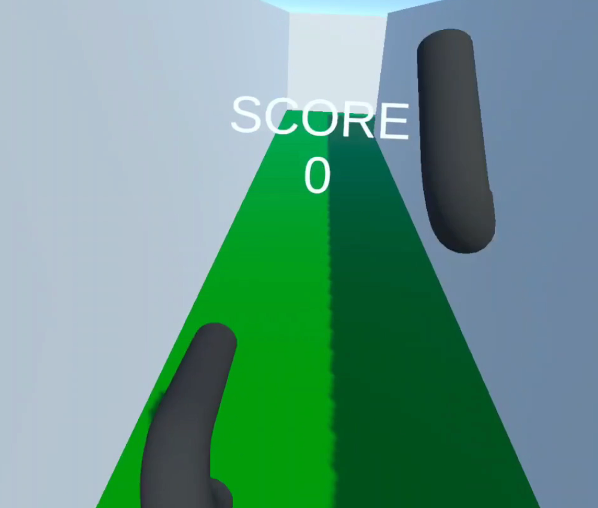
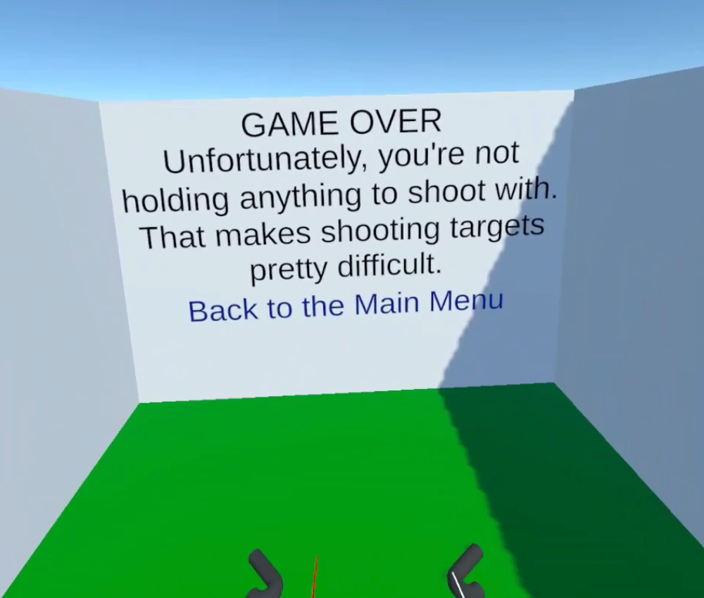
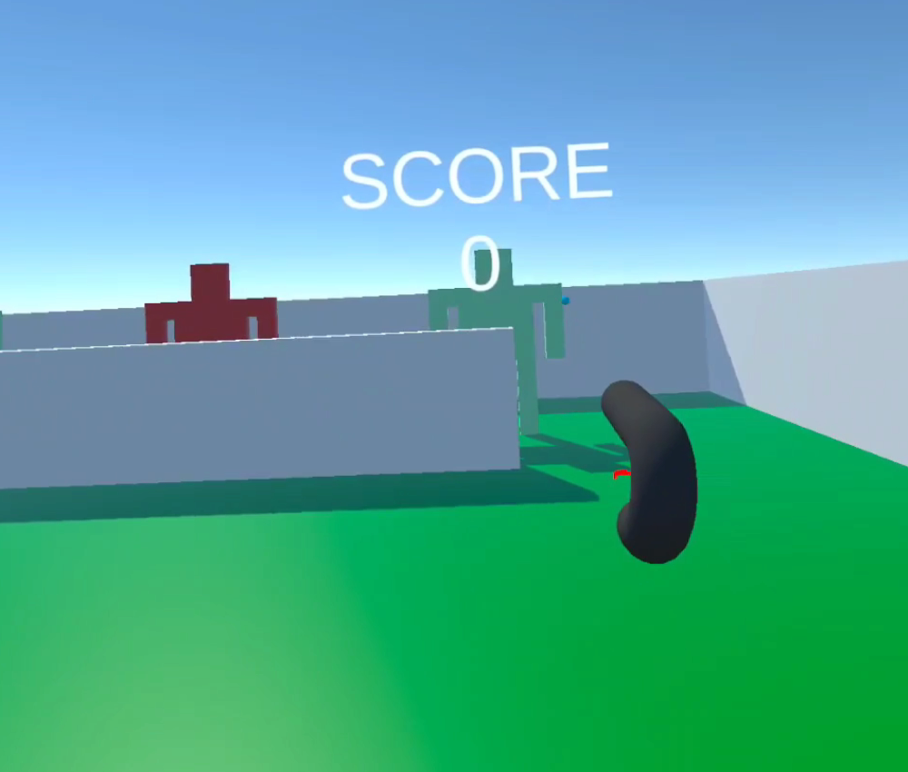
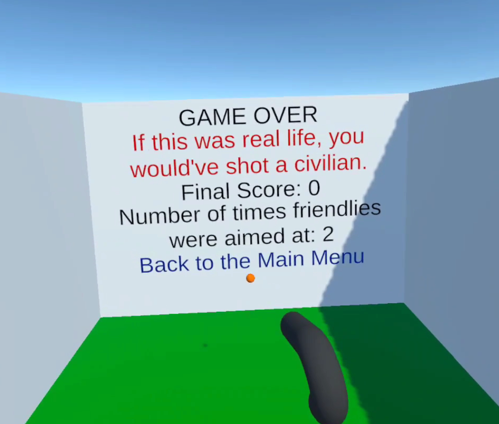
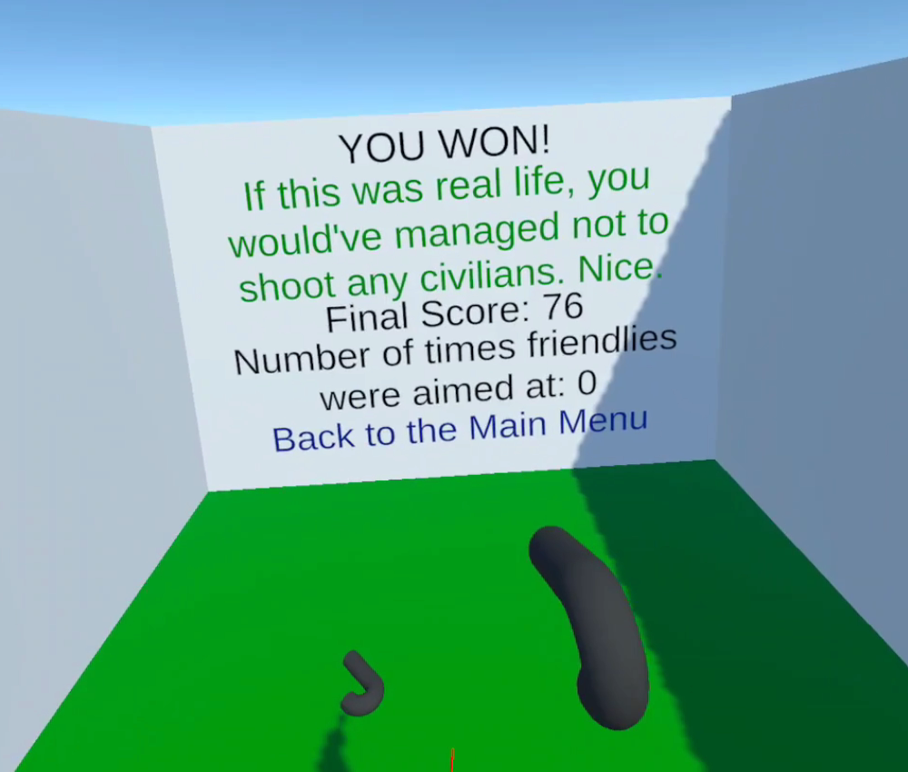

# Gameplay Image Gallery
## Scenes

    <h3 style="float: left; width: 51%"><a href="./Scenes/mainMenu.html">Main Menu</a></h3>
    <h3 style="float: left">Range</h3>

### [Training Course](./Scenes/trainingCourse.html)

### [Self Harm Prevention](./Scenes/selfHarmPrevention.html)

### [Dropping Guns in Training Course](./Scenes/droppedGunsPrevention.html)

### [Losing](./Scenes/lose.html)

### [Winning](./Scenes/win.html)

