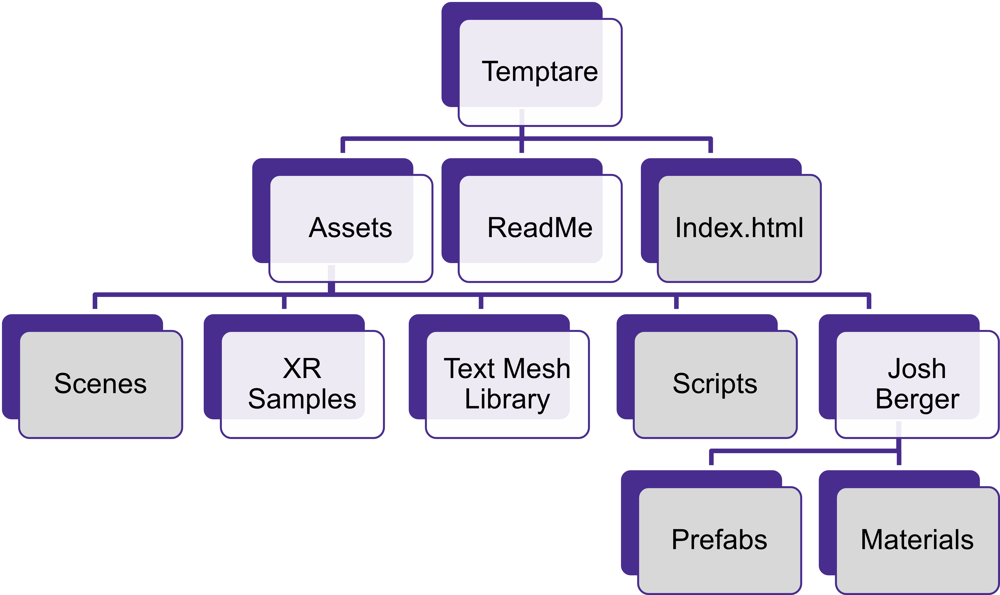

# TEMPTARE[^1]

  <iframe width="560" height="560" src="https://www.youtube.com/embed/iVY4b_V9NLc?si=vrloGeE0IZn09-kS?controls=0&autoplay=1&loop=1"></iframe>

## Description
Temptare is a Virtual Reality first person shooter that teaches gun safety through interactive gameplay. The player has the option to go through a training course where they must shoot enemy targets, avoid shooting friendly targets, and handle their gun with care. The player does not have to move themself through the training course. They are automatically moved through the course to reduce motion sickness. The player also has the option to get a hang of the controls on a shooting range. The game is designed to be both educational and entertaining, with the goal of improving gun safety knowledge and decision-making skills. The game was developed using Unity and C# and is intended to be played on a VR headset.

## Hierarchy

This is the hierarchical breakdown of the GitHub repository for this project. All the grey portions are referenced on this site.

## Navigating This Site
### Gameplay Image Gallery
This section includes images and a video from playing the game. Starting here would paint a good picture for the Code, Prefabs, and Scenes sections.

### Code
This section describes all of the scripts I made to program the interactions and mechanics of the game.

### Prefabs
This section describes all of the pre-made objects for the game that populate the scenes and have the scripts attached to them.

### Scenes
This section describes all the scenes (or levels) that make up the game.

### Research
This section describes the research demonstrating Virtual Reality has the potential to be better for education than traditional learning methods and its applications towards teaching gun safety.

## Purpose
Temptare and this site were created to fulfill requirements for my CSC-475 Seminar in Computer Science course at Furman University in the Spring of 2024.

----

[^1]: Temptare means to try or attempt in Latin, which is fitting since this is my first attempt at game development.
