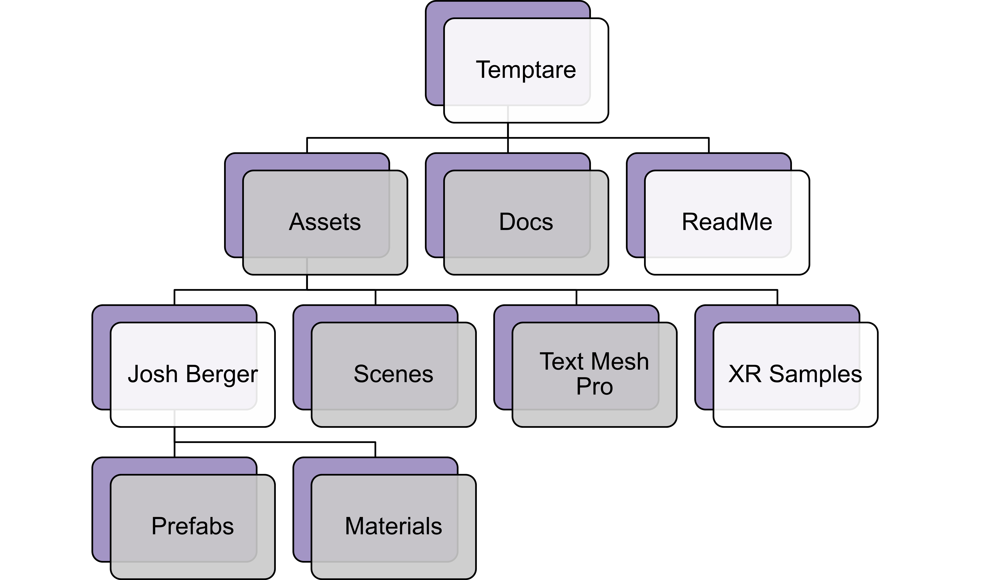

# TEMPTARE[^1]
## Description
**Gun safety** is a pressing issue in the United States at the moment. According to Megan L. Ranney et al., "firearm injury and death are a major public health problem, with more than **40,000 deaths and an estimated 85,000-130,000 injuries a year**"[^2]. Additionally, there are approximately 20 instances in which hunters accidentally shoot a human instead of a deer each year in the United States[^3]. Therefore, something needs to be done to reduce the number of people harmed or killed by guns each year. Educating people on where to point the gun and when to pull the trigger could be a possible solution. That's why I made Temptare. Temptare is a **Virtual Reality** video game intended to replicate Call of Duty: **Modern Warfare II**'s Training Course mixed with elements from the **Men in Black: Alien Attack** ride at Universal Studios in Orlando, Florida. I chose Virtual Reality as the medium for Temptare, because Virtual Reality has the potential to increase the user's learner enjoyment (motivation)[^4] and immersion[^5] over traditional learning techniques. Additionally, Virtual Reality can be an effective means of eliminating risks, because it takes guns out of beginners hands and operates in a safe, controlled environment[^6].

## Hierarchy

This is the hierarchical breakdown of the GitHub repository for this project. All of the grey portions are referenced on this site.

## Navigating This Site
**Gameplay Image Gallery**
This section includes images and a video from playing the game. Starting here would paint a good picture for the Code, Prefabs, and Scenes sections.

**Code**
This section describes all of the scripts I made to program the interactions and mechanics of the game.

**Prefabs**
This section describes all of the pre-made objects for the game that populate the scenes and have the scripts attached to them.

**Scenes**
This section describes all the scenes (or levels) that make up the game.

----

[^1]: Temptare means to try or attempt in Latin, which is fitting since this is my first attempt at game development.
[^2]: Megan L. Ranney, Frederica R. ConrSey, Leah Perkinson, Stefanie Friedhoff, Rory Smith, and Claire Wardle. How Americans Encounter Guns: Mixed Methods Content Analysis of Youtube and Internet Search Data. _Preventive Medicine_, 165:107258, 2022.
[^3]: Karl E. Bridges, Paul M. Corballis, Mike Spray, and Joseph Bagrie. Testing Failure-to-Identify Hunting Incidents Using an Immersive Simulation: Is it Viable? _Applied Ergonomics_, 93:103358, 2021.
[^4]: Christian Hartmann, Younes Orli-Idrissi, Laura Claudia Johanna Pflieger, and Maria Bannert. Imagine & Immerse Yourself: Does Visuospatial Imagery Moderate Learning in Virtual Reality? _Computers & Education_, 207:104909, 2023.
[^5]: Mel Slater, Bernhard Spanlang, Maria V. Sanchez-Vives, and Olaf Blanke. First person experience of body transfer in virtual reality. _PloS one_, 5(5):e10564, 2010.
[^6]: Camilla Elena Magi, Stefano Bambi, Paolo Iovino, Khadija El Aoufy, Carla Amato, Chiara Balestri, Laura Rasero, and Yari Longobucco. Virtual Reality and Augmented Reality Training in Disaster Medicine Courses for Students in Nursing: A Scoping Review of Adoptable Tools. _Behavioral Sciences_, 13(7):616, 2023.
