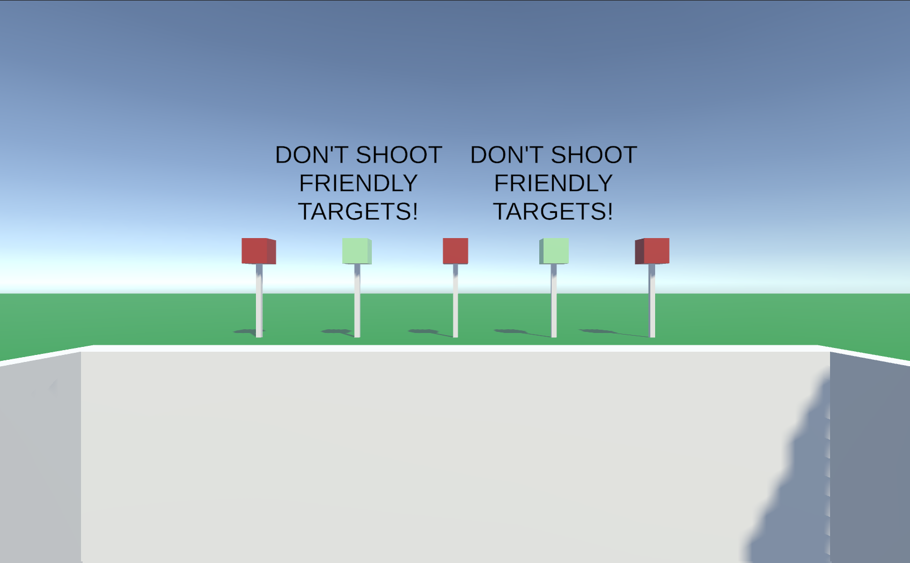

# Prefabs
**I plan to add images for nearly all the Prefabs and redo their descriptions.**

"Prefabs are a special type of component that allows fully configured GameObjects to be saved in the Project for reuse. These assets can then be shared between scenes, or even other projects without having to be configured again." [^1]

### Key Terms

"GameObjects are the fundamental objects in Unity that represent characters, props and scenery. They do not accomplish much in themselves but they act as containers for Components, which implement the real functionality." [^2]

"Components are the functional pieces of every GameObject. Components contain properties which you can edit to define the behavior of a GameObject." [^3]

"Rigidbodies enable your GameObjects to act under the control of physics. The Rigidbody can receive forces and torque to make your objects move in a realistic way. Any GameObject must contain a Rigidbody to be influenced by gravity, act under added forces via scripting, or interact with other objects through the NVIDIA PhysX physics engine." [^4]

"Collider components define the shape of an object for the purposes of physical collisions. A collider, which is invisible, need not be the exact same shape as the object's mesh and in fact, a rough approximation is often more efficient and indistinguishable in gameplay." [^5]
  A BoxCollider is a type of Collider.

### Blaster:

- A charcoal grey GameObject that resembles an umbrella handle
- The mesh was taken from the Unity VR (Core) Template in Unity Hub
- There is an attach point at the base of the handle which designates where the user will hold it in their hand
- There is a spawn point at the end of the barrel which designates where the projectile will be fired projectile
- Has a RigidBody
- Has two BoxColliders to fit the shape of the object
- has the LaunchProjectile script attached
- Is an [XR Grab Interactable](https://docs.unity3d.com/Packages/com.unity.xr.interaction.toolkit@2.0/manual/xr-grab-interactable.html), so the user can equip it

### Bullet

- A spherical GameObject that is fired by the Blaster
- Moves forward until it collides with another GameObject
- Has the Projectile script attached

### Barricade

- Four white walls to surround the user, with a height of half of the camera's y-position
- Each wall has a BoxCollider

### Body

- Made to resemble a red or green cardboard cutout of a person 
- Is only used in the Training Course scene
- It is made up of 7 thin cubes:
  - Head
  - Torso
  - Shoulders
  - Right Arm
  - Left Arm
  - Right Leg
  - Left Leg
- Each cube had to have a tag (target or friendly) and a BoxCollider for the collisions with bullets to work
- Two different types: 
  - Body F, which is green and designates a friendly target, either makes you lose the game
  - Body T, which is red and designates a hostile target, increases score when shot

### Target 

- Red cube
- Hostile target
- Has a BoxCollider
- Increases the score when shot
- Is only used in the Range scene

### Friendly

- Green cube 
- Friendly target
- Has a BoxCollider
- Displays the WarningCanvas Prefab when shot
- Is only used in the Range scene

### Pole

- Pole to hold up the Targets and Friendlies in the Range scene

### CameraColliders

- There are several different Prefabs in this category including
  - **CameraDirectionChanger** - When the camera collides with this, the camera's direction is set to this object's direction.
  - **CameraStopper** - When the camera collides with this, the camera stops moving.
  - **CameraBodyFlipper** - When the camera collides with this, the nearby bodies (targets), which are lying down, are flipped up.
  - **CamerBodyRaiser** - When the camera collides with this, the nearby bodies (targets), which are underground, are raised aboveground.
  - **CameraWinInvoker** - When the camera collides with this, the Win scene is loaded. The user should only reach it if they made it through the whole Training Course without doing something forbidden (i.e. aim at themselves or shoot a Friendly).

### ScoreUI

- Transparent canvas
- It has two [TextMeshPro](https://docs.unity3d.com/Manual/com.unity.textmeshpro.html) objects with white text
- The top says, "SCORE"
- The bottom displays the score

### SelfHarmHandler

- A transparent object that is directly behind the user so aiming at themself can be detected
- If it is aimed at, the SelfHarmPrevention scene is loaded

### WarningCanvas

- A message telling the user not to shoot friendly targets
- Spawned above a friendly target if the user shoots it in the Range Scene

----

[^1]: [UnityLearn - Prefabs](https://learn.unity.com/tutorial/prefabs-e#)
[^2]: [UnityDocs - GameObject](https://docs.unity3d.com/560/Documentation/Manual/class-GameObject.html)
[^3]: [UnityDocs - Components](https://docs.unity3d.com/Manual/Components.html#:~:text=Components%20are%20the%20functional%20pieces,the%20Components%20attached%20to%20it.)
[^4]: [UnityDocs - RigidBody](https://docs.unity3d.com/560/Documentation/Manual/class-Rigidbody.html)
[^5]: [UnityDocs - Collider](https://docs.unity3d.com/560/Documentation/Manual/CollidersOverview.html#:~:text=Collider%20components%20define%20the%20shape,efficient%20and%20indistinguishable%20in%20gameplay.)

