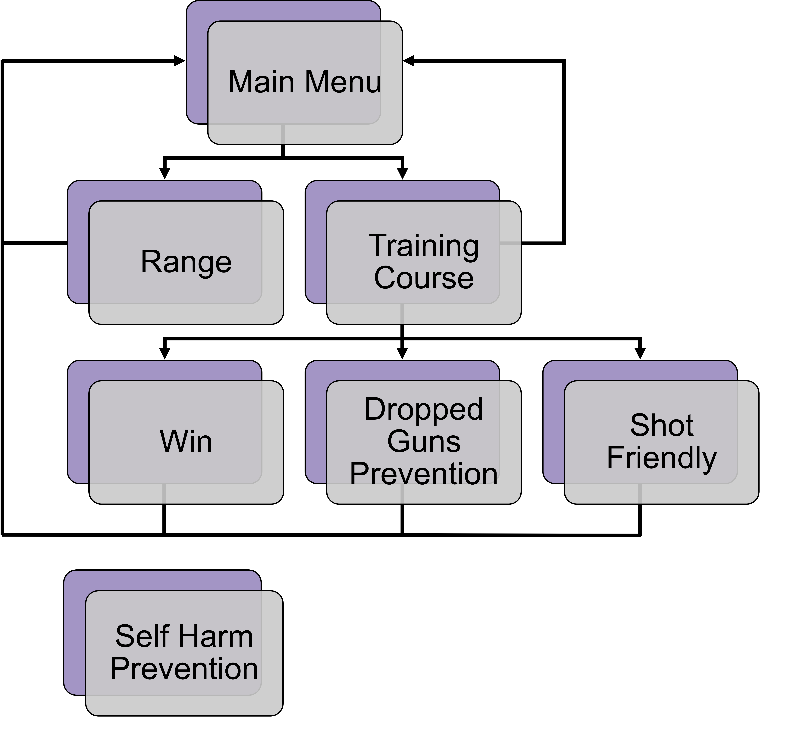

# Scenes
"Scenes contain the objects of your game. They can be used to create a main menu, individual levels, and anything else. Think of each unique Scene file as a unique level. In each Scene, you will place your environments, obstacles, and decorations, essentially designing and building your game in pieces."[^1]

## Scene Progression

This is the progression of the scenes. From the Main Menu scene, you can go to either the Range or the Training Course. From the Range, you can go back to the Main Menu. Based on how you do in the Training Course, you will be taken to The Win scene, Dropped Guns Prevention, or Shot Friendly scene or you could choose to go back to the Main Menu.

The Self Harm Prevention scene is not included in the progression, because the user will be sent there no matter which scene they are in. Obviously, you should never aim a weapon at yourself.

----

[^1]: [UnityDocs](https://docs.unity3d.com/560/Documentation/Manual/CreatingScenes.html)
