## Gameplay
### Main Menu
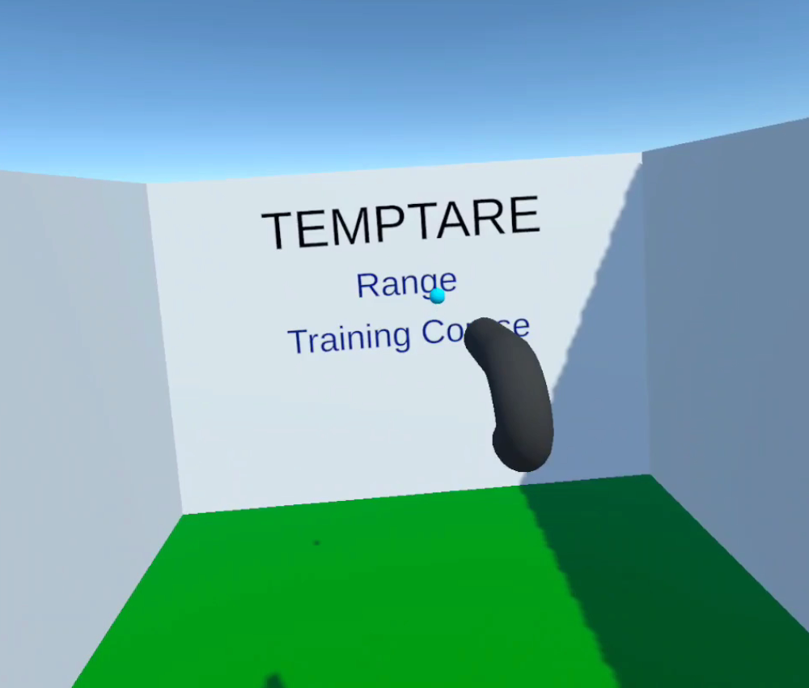
### Range
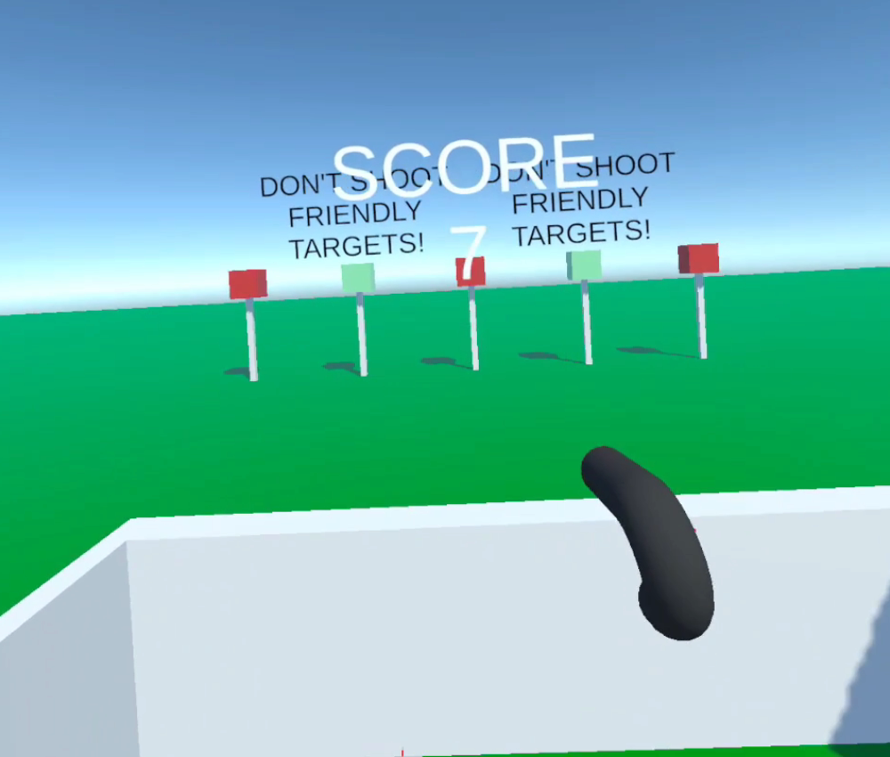
### Training Course
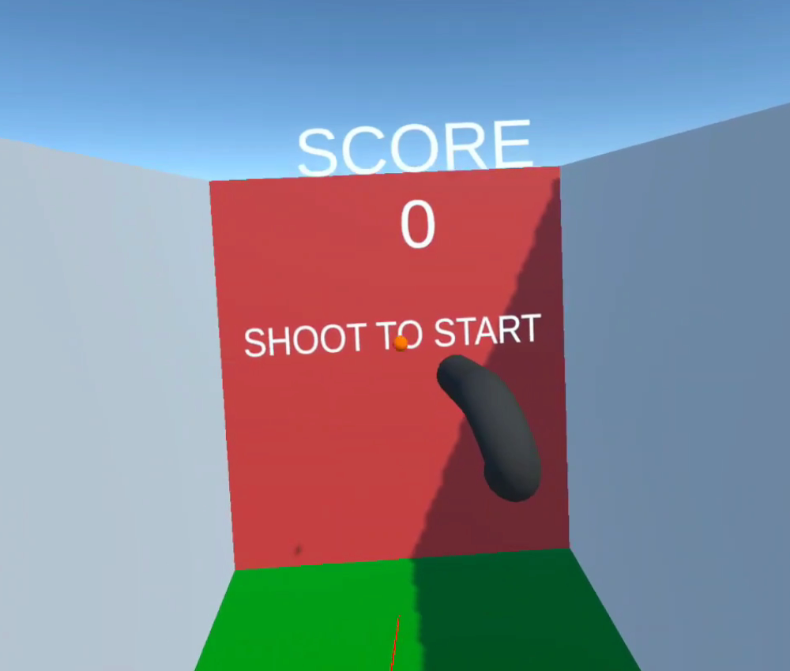
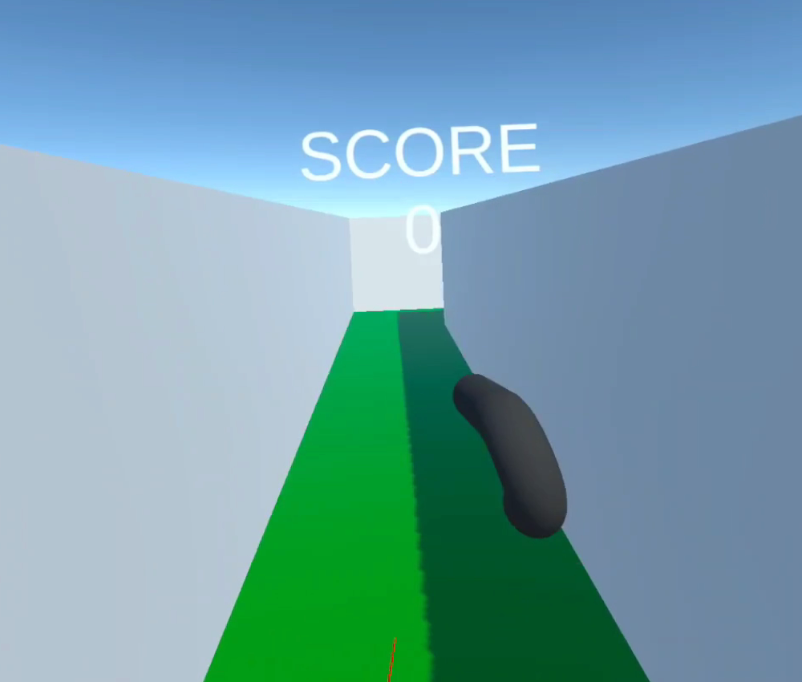
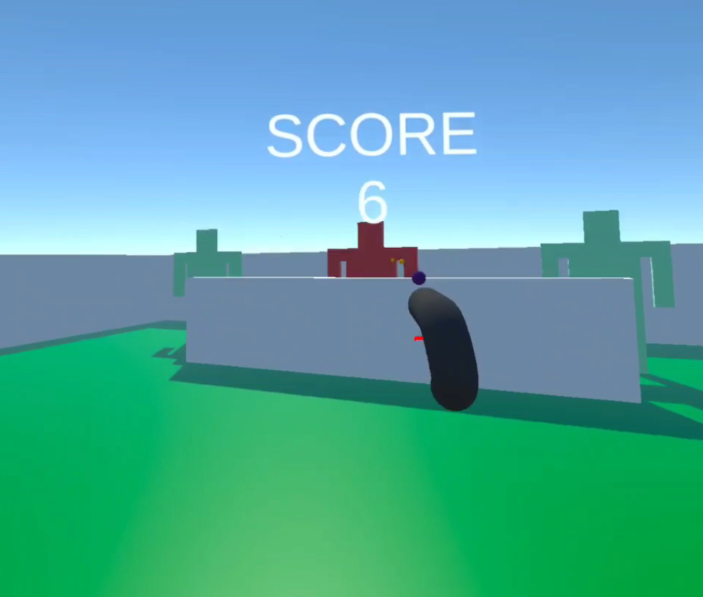
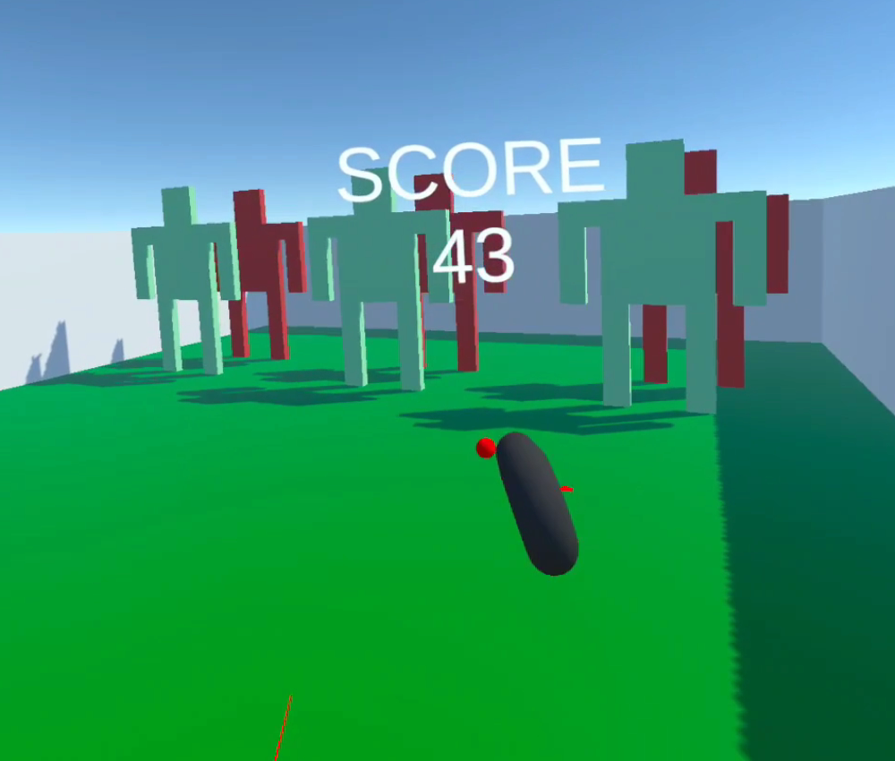
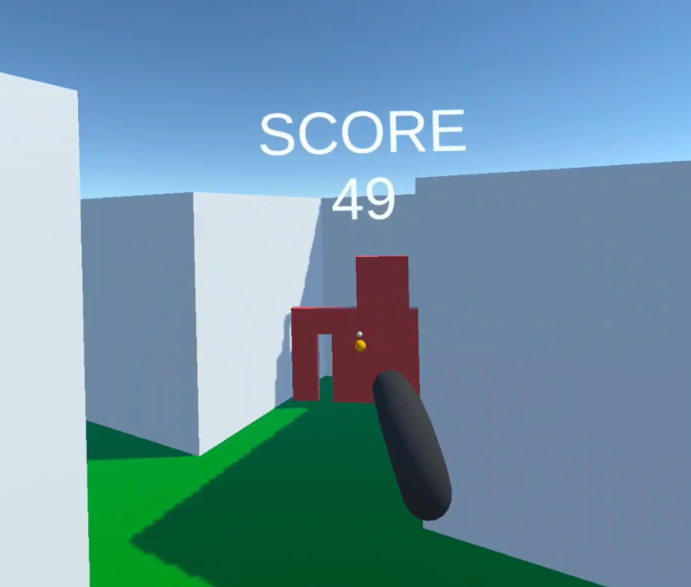
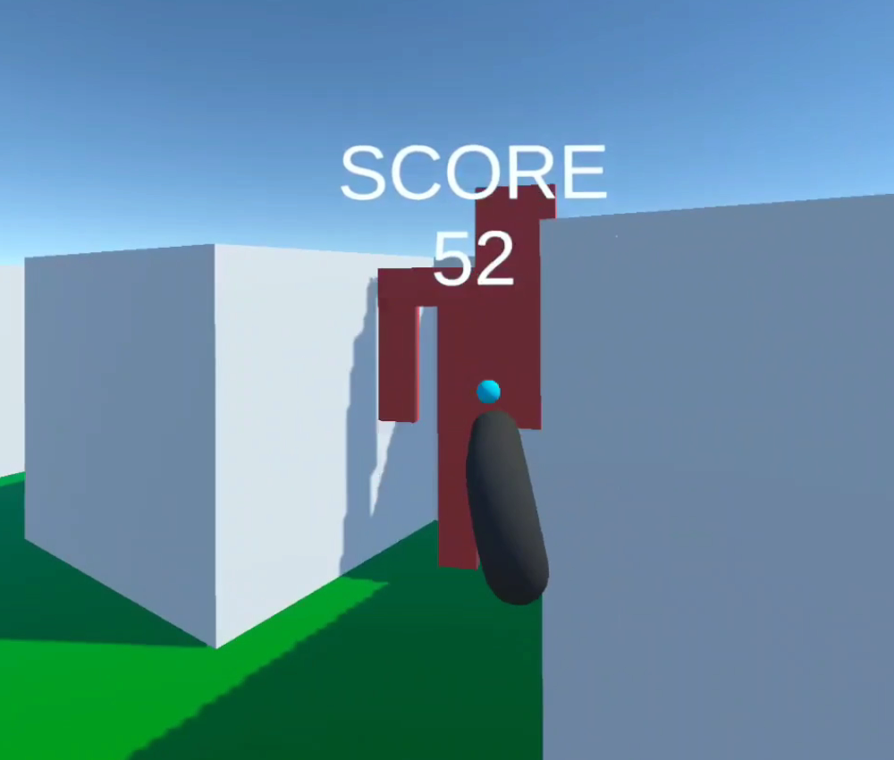
### Winning

### Losing

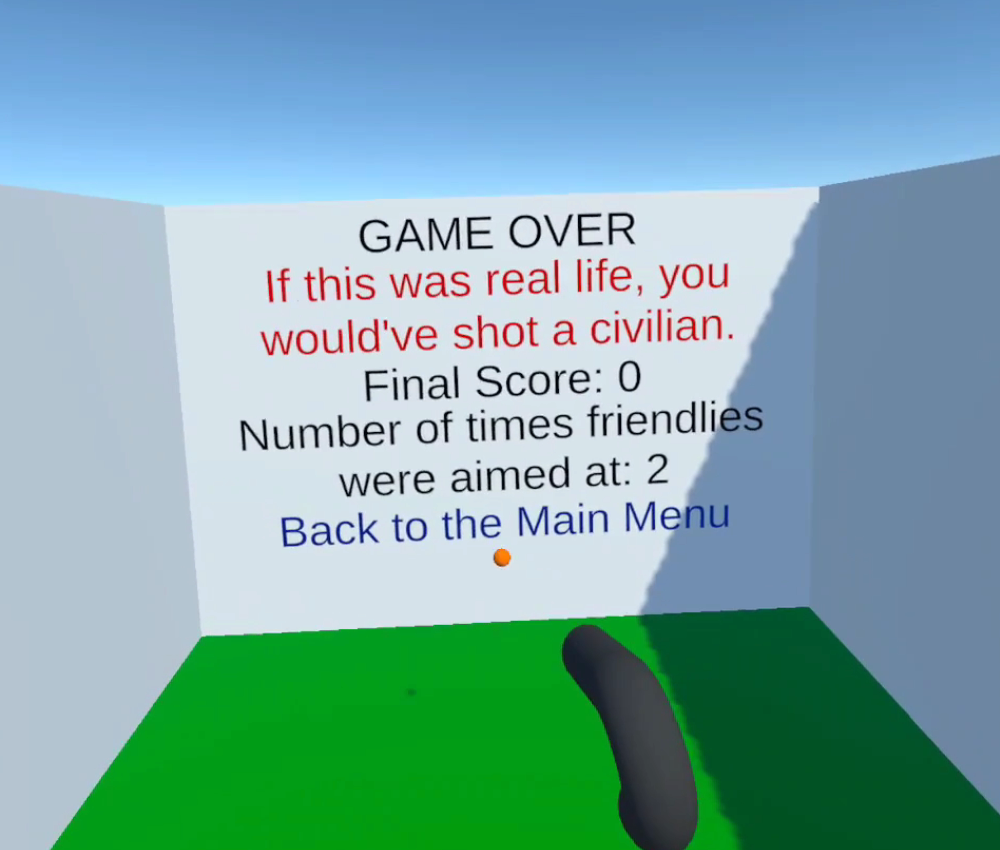
### Self Harm Prevention
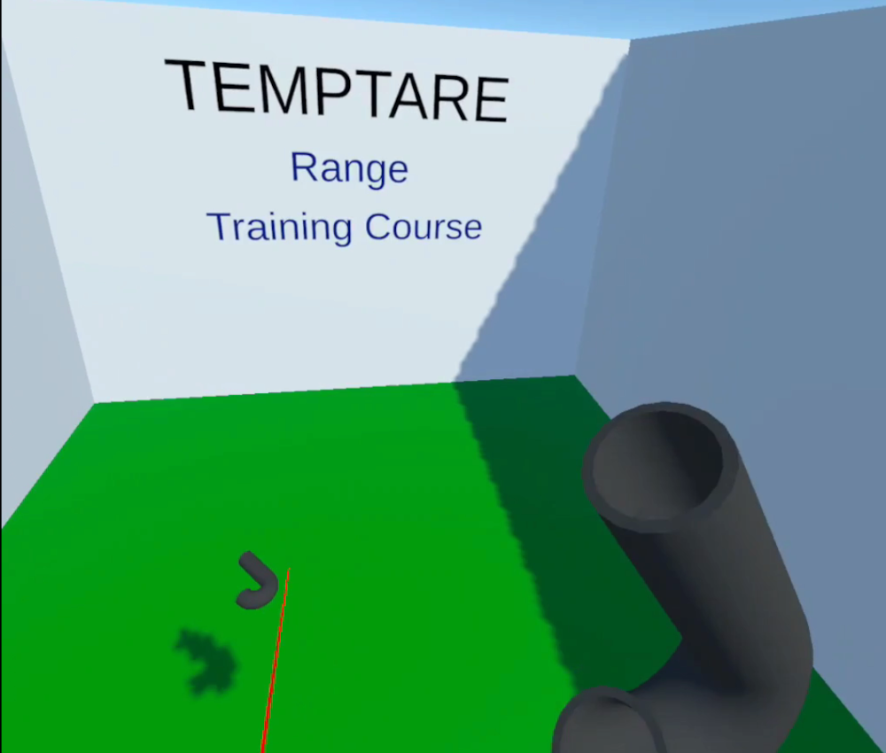

### Dropping Guns in Training Course

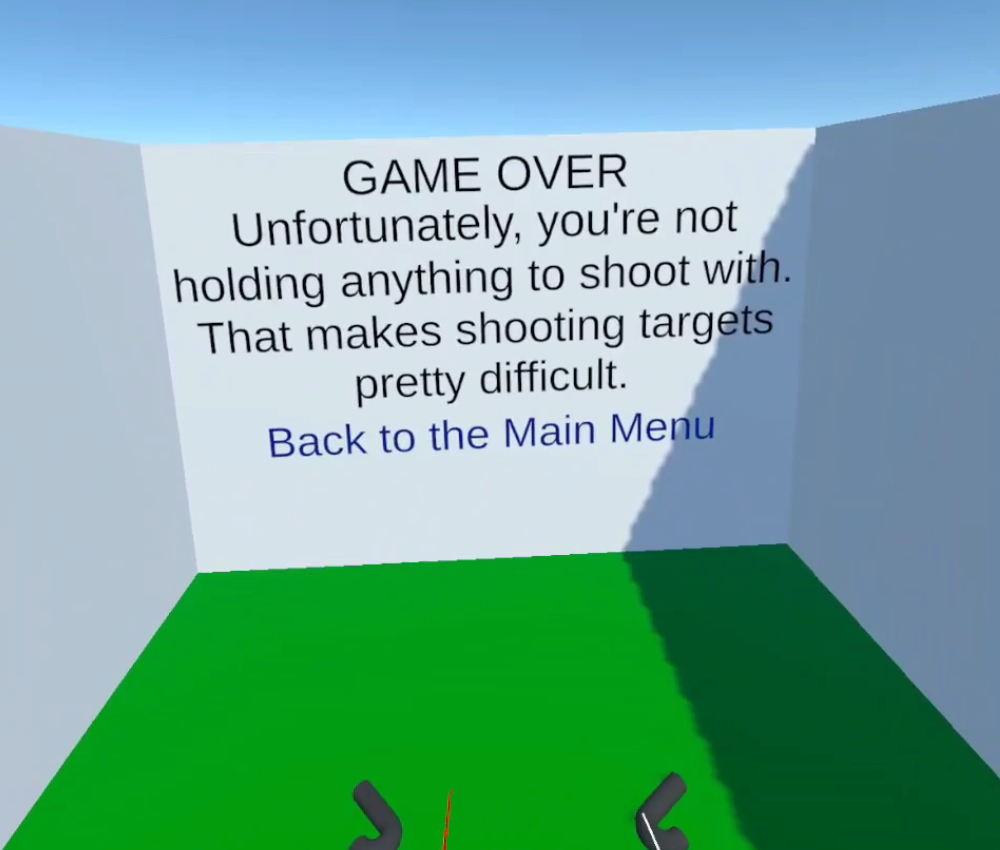

----
[^1]: Temptare means to try or attempt in Latin, which is fitting since this is my first attempt at game development.
[^2]: Megan L. Ranney, Frederica R. ConrSey, Leah Perkinson, Stefanie Friedhoff, Rory Smith, and Claire Wardle. How Americans Encounter Guns: Mixed Methods Content Analysis of Youtube and Internet Search Data. _Preventive Medicine_, 165:107258, 2022.
[^3]: Karl E. Bridges, Paul M. Corballis, Mike Spray, and Joseph Bagrie. Testing Failure-to-Identify Hunting Incidents Using an Immersive Simulation: Is it Viable? _Applied Ergonomics_, 93:103358, 2021.
[^4]: Christian Hartmann, Younes Orli-Idrissi, Laura Claudia Johanna Pflieger, and Maria Bannert. Imagine & Immerse Yourself: Does Visuospatial Imagery Moderate Learning in Virtual Reality? _Computers & Education_, 207:104909, 2023.
[^5]: Mel Slater, Bernhard Spanlang, Maria V. Sanchez-Vives, and Olaf Blanke. First person experience of body transfer in virtual reality. _PloS one_, 5(5):e10564, 2010.
[^6]: Camilla Elena Magi, Stefano Bambi, Paolo Iovino, Khadija El Aoufy, Carla Amato, Chiara Balestri, Laura Rasero, and Yari Longobucco. Virtual Reality and Augmented Reality Training in Disaster Medicine Courses for Students in Nursing: A Scoping Review of Adoptable Tools. _Behavioral Sciences_, 13(7):616, 2023.